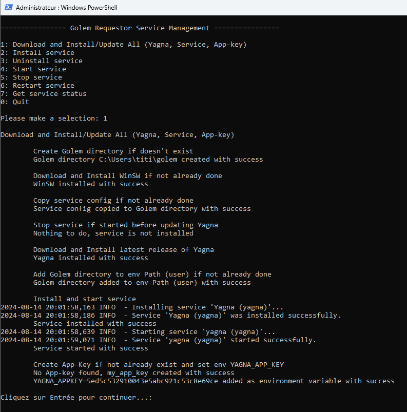

# Windows Golem Requestor Installer

I wrote this little Powershell script to make it easier to install/update & manage the Golem Requestor daemon for Windows.

Indeed, initially, you have to:
- download the latest Yagna binaries on the Golem repository
- extract them somewhere on your system
- add the path to the Path environment variable
- create the app-key
- add this key as an environment variable

And for each use of the network, first launch the daemon in a dedicated window before running your application.  

Thus, this script allows to automate the installation and manage the daemon.  
Yagna daemon does not implement Windows service methods, so we use the WinSW binary in order to wrap this daemon as a service.
  
**How to use:**  

Download and extract (or clone), this repository on your system, open a Powershell terminal as Administrator and go to the directory where this setup is located, then run: 
```
powershell.exe -ExecutionPolicy Bypass -File install_golem_requestor.ps1
```

<p align="center">
 
</p>
