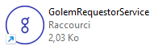
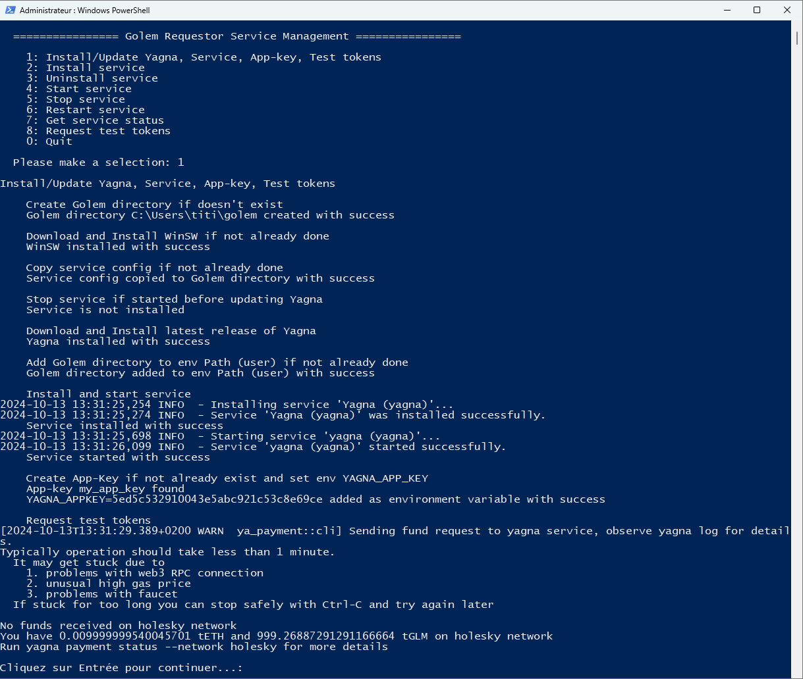

<h1 align="center"> Windows Golem Requestor Installer </h1>

## Why this installer
I wrote this installer to make it easier to install/update & manage the Golem Requestor daemon for Windows.
Indeed, initially, you have to:
- download the latest Yagna binaries on the Golem repository
- extract them somewhere on your system
- add the path to the Path environment variable
- create the app-key
- request test tokens  

In addition, as Yagna daemon does not implement Windows service methods, you nedd to first launch the daemon in a dedicated window before running your application.  
WinSW is used to wrap Yagna daemon as a Windows service.

**Thus, this tool makes it possible to automate the installation and management of the daemon.**  
**Once installed, no need to worry about the daemon anymore, it is launched automatically, just start your application.**  
  
## How to use  
- Download and extract (or clone) this repository somewhere on your system.  
- Click on CreateShortcut.bat to create a shortcut on your desktop.
- Launch GolemRequestorService by clicking on shortcut.
- Select option 1 to install.

   

  
Additional actions are available to manage the service.  
To update Yagna just relaunch GolemRequestorService and select option 1 (as for initial installation).  
  

 

